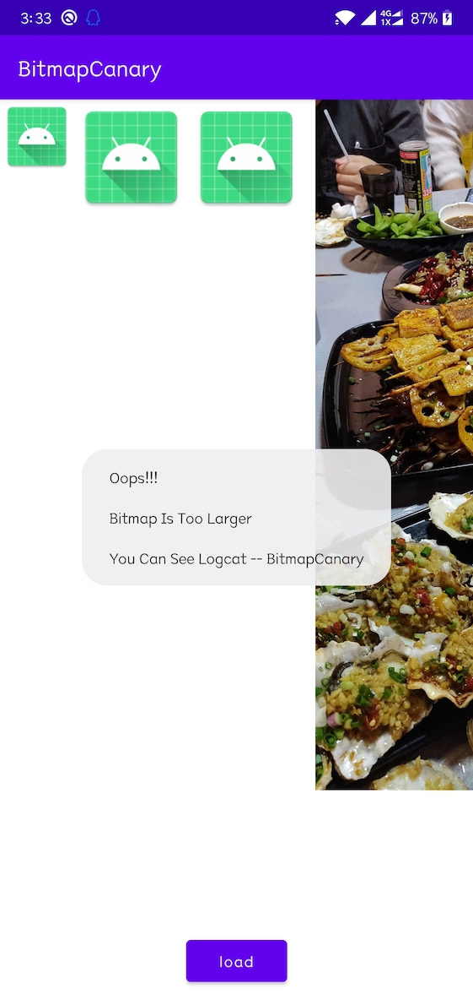

# BitmapCanary

Android大图监控，支持5.0-11的系统。

| Toast                     | Log                    |
| ------------------------- | ---------------------- |
|  |  |

## 依赖

[](https://jitpack.io/#simplepeng/BitmapCanary)

```groovy
allprojects {
	repositories {
		...
		maven { url 'https://jitpack.io' }
	}
}
```

```groovy
dependencies {
	debugImplementation 'com.github.simplepeng.BitmapCanary:bitmap_canary:v1.0.2'
	releaseImplementation 'com.github.simplepeng.BitmapCanary:bitmap_canary_no_op:v1.0.2'
}
```

## 使用

在`AndroidManifest.xml`中配置可选项

```xml
<manifest>
    <application>
        <!--    监控阈值，kb    -->
         <meta-data
             android:name="bitmap_canary_threshold_value"
             android:value="3000" />
        <!--    是否允许输出Log    -->
        <meta-data
            android:name="bitmap_canary_enable_log"
            android:value="true" />
        </application>
</manifest>
```

可以不配置，监控阈值默认为3M，默认是输出log的。

## 版本迭代

* v1.0.2：增加忽略相关类的api，增加Activity中依附的Fragment输出

* v1.0.1：优化输出

* v1.0.0：首次发布
